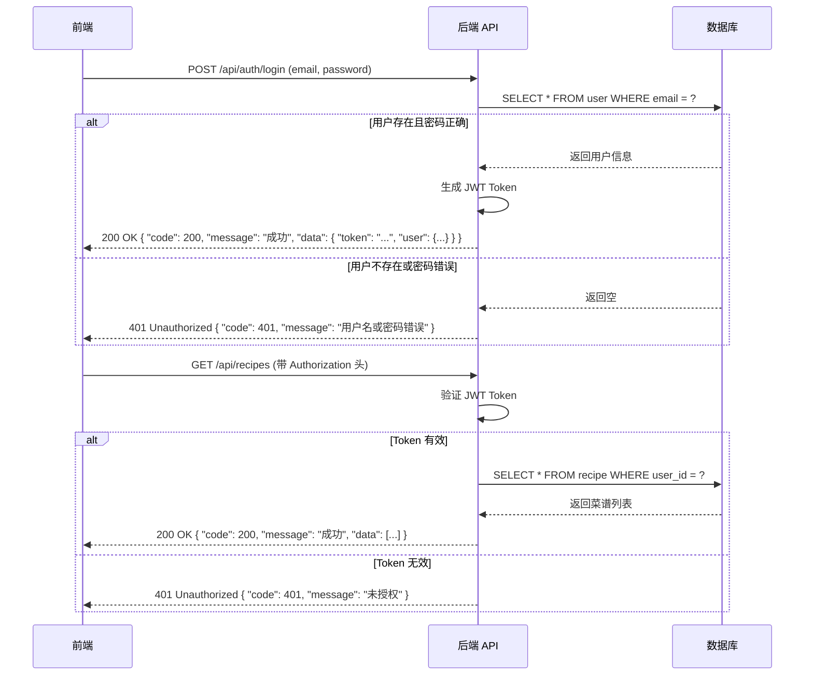

# 我的菜谱项目需求分析和技术架构文档

## 1. 需求分析

### 1.1 产品背景

随着人们生活水平的提高，越来越多的人开始关注健康饮食和烹饪。然而，很多人在烹饪过程中面临着菜谱管理、食材采购、烹饪步骤记录等问题。为了解决这些问题，我们开发了一个"我的菜谱"应用，帮助用户方便地管理和分享自己的菜谱，提高烹饪效率和乐趣。

### 1.2 产品目标

- 帮助用户管理个人菜谱，包括添加、编辑、删除和查询
- 提供食材管理功能，帮助用户记录和管理食材库存
- 支持菜谱分类和标签，方便用户快速找到所需菜谱
- 提供烹饪步骤的详细记录和展示
- 支持用户分享菜谱，促进用户之间的交流
- 提供菜谱搜索和推荐功能，帮助用户发现新菜谱

### 1.3 功能需求

#### 1.3.1 用户管理模块

| 功能点 | 描述 |
|-------|------|
| 用户注册 | 用户通过邮箱和密码注册账号 |
| 用户登录 | 用户通过邮箱和密码登录系统 |
| 密码重置 | 用户忘记密码时可以重置密码 |
| 个人资料管理 | 用户可以修改个人资料，包括昵称、头像等 |

#### 1.3.2 菜谱管理模块

| 功能点 | 描述 |
|-------|------|
| 菜谱列表 | 展示用户的所有菜谱，支持分页和排序 |
| 菜谱详情 | 展示菜谱的详细信息，包括名称、封面图、食材、步骤等 |
| 添加菜谱 | 用户可以添加新菜谱，包括填写名称、描述、食材、步骤等 |
| 编辑菜谱 | 用户可以编辑已有的菜谱信息 |
| 删除菜谱 | 用户可以删除自己的菜谱 |
| 菜谱分类 | 支持对菜谱进行分类管理 |
| 菜谱标签 | 支持为菜谱添加标签，方便搜索和筛选 |

#### 1.3.3 食材管理模块

| 功能点 | 描述 |
|-------|------|
| 食材列表 | 展示用户的所有食材，支持分页和排序 |
| 食材详情 | 展示食材的详细信息，包括名称、数量、保质期等 |
| 添加食材 | 用户可以添加新食材，包括填写名称、数量、单位等 |
| 编辑食材 | 用户可以编辑已有的食材信息 |
| 删除食材 | 用户可以删除自己的食材 |
| 食材分类 | 支持对食材进行分类管理 |

#### 1.3.4 搜索和推荐模块

| 功能点 | 描述 |
|-------|------|
| 菜谱搜索 | 用户可以通过关键词搜索菜谱 |
| 食材搜索 | 用户可以通过关键词搜索食材 |
| 菜谱推荐 | 根据用户的历史浏览和收藏记录推荐菜谱 |
| 热门菜谱 | 展示平台上的热门菜谱 |

#### 1.3.5 分享模块

| 功能点 | 描述 |
|-------|------|
| 菜谱分享 | 用户可以将菜谱分享到社交媒体 |
| 分享链接 | 生成菜谱的分享链接，方便他人访问 |

### 1.4 非功能需求

#### 1.4.1 性能需求

- 页面加载时间不超过 3 秒
- API 响应时间不超过 1 秒
- 系统支持至少 1000 个并发用户

#### 1.4.2 安全需求

- 用户密码使用 BCrypt 加密存储
- 所有 API 请求需要进行身份验证
- 防止 SQL 注入、XSS 攻击等安全问题
- 敏感信息加密传输

#### 1.4.3 可靠性需求

- 系统可用性达到 99.9%
- 数据定期备份
- 系统故障恢复时间不超过 1 小时

#### 1.4.4 易用性需求

- 界面简洁美观，操作流程清晰
- 支持响应式设计，适配不同设备
- 提供友好的错误提示和操作引导

### 1.5 数据需求

#### 1.5.1 用户数据

- 用户基本信息：ID、邮箱、密码、昵称、头像、注册时间、最后登录时间

#### 1.5.2 菜谱数据

- 菜谱基本信息：ID、用户ID、名称、描述、封面图、烹饪时间、难度、创建时间、更新时间
- 菜谱分类：ID、名称、描述
- 菜谱标签：ID、名称
- 菜谱-标签关联：菜谱ID、标签ID

#### 1.5.3 食材数据

- 食材基本信息：ID、用户ID、名称、数量、单位、保质期、创建时间、更新时间
- 食材分类：ID、名称、描述

#### 1.5.4 烹饪步骤数据

- 步骤基本信息：ID、菜谱ID、步骤顺序、内容、图片

## 2. 技术架构

### 2.1 技术选型

| 分类 | 技术 | 版本 | 选型理由 |
|------|------|------|----------|
| 前端框架 | Vue 3 | 3.3.4 | 采用组合式 API，性能优异，生态成熟 |
| 构建工具 | Vite | 4.4.5 | 快速的开发服务器和构建工具，支持热更新 |
| 类型系统 | TypeScript | 5.0.2 | 提供类型安全，减少运行时错误 |
| UI 框架 | Element Plus | 2.3.12 | 组件丰富，样式美观，易于使用 |
| 状态管理 | Pinia | 2.1.4 | Vue 3 官方推荐的状态管理库，API 简洁 |
| HTTP 客户端 | Axios | 1.4.0 | 功能强大的 HTTP 客户端，支持拦截器和请求配置 |
| 路由 | Vue Router | 4.2.4 | Vue 官方路由库，支持嵌套路由和路由守卫 |
| 后端框架 | Spring Boot | 3.1.0 | 快速开发 Java 应用的框架，自动配置，内嵌服务器 |
| 数据库 | MySQL | 8.0 | 关系型数据库，稳定可靠，适合存储结构化数据 |
| ORM 框架 | MyBatis-Plus | 3.5.3 | 简化 MyBatis 开发，提供丰富的 CRUD 操作 |
| 认证框架 | Spring Security | 6.1.0 | 提供完整的认证和授权功能 |
| API 文档 | Swagger | 3.0.0 | 自动生成 API 文档，方便前后端协作 |
| 构建工具 | Maven | 3.9.0 | 项目管理和依赖管理工具 |

### 2.2 系统架构

#### 2.2.1 架构风格

采用前后端分离架构，前端负责页面渲染和用户交互，后端负责业务逻辑和数据处理。

#### 2.2.2 模块划分

| 模块 | 职责 | 技术实现 |
|------|------|----------|
| 前端应用 | 用户界面和交互 | Vue 3 + TypeScript + Element Plus |
| 后端 API | 业务逻辑和数据处理 | Spring Boot + MyBatis-Plus |
| 数据库 | 数据存储 | MySQL 8.0 |
| 认证服务 | 用户认证和授权 | Spring Security |
| 文件存储 | 图片等文件存储 | 本地存储或云存储 |

#### 2.2.3 核心流程图



### 2.3 数据库设计

#### 2.3.1 数据库表结构

**`user` 表**
| 字段名 | 数据类型 | 约束 | 描述 |
|-------|---------|------|------|
| `id` | `BIGINT` | `PRIMARY KEY, AUTO_INCREMENT` | 用户ID |
| `email` | `VARCHAR(255)` | `UNIQUE, NOT NULL` | 邮箱 |
| `password` | `VARCHAR(255)` | `NOT NULL` | 密码（加密） |
| `nickname` | `VARCHAR(50)` | `NOT NULL` | 昵称 |
| `avatar` | `VARCHAR(255)` | | 头像URL |
| `created_at` | `DATETIME` | `NOT NULL, DEFAULT CURRENT_TIMESTAMP` | 创建时间 |
| `updated_at` | `DATETIME` | `NOT NULL, DEFAULT CURRENT_TIMESTAMP ON UPDATE CURRENT_TIMESTAMP` | 更新时间 |

**`recipe` 表**
| 字段名 | 数据类型 | 约束 | 描述 |
|-------|---------|------|------|
| `id` | `BIGINT` | `PRIMARY KEY, AUTO_INCREMENT` | 菜谱ID |
| `user_id` | `BIGINT` | `NOT NULL, FOREIGN KEY (user_id) REFERENCES user(id)` | 用户ID |
| `name` | `VARCHAR(100)` | `NOT NULL` | 菜谱名称 |
| `description` | `TEXT` | | 菜谱描述 |
| `cover_image` | `VARCHAR(255)` | | 封面图URL |
| `cooking_time` | `INT` | | 烹饪时间（分钟） |
| `difficulty` | `VARCHAR(20)` | | 难度（简单、中等、困难） |
| `created_at` | `DATETIME` | `NOT NULL, DEFAULT CURRENT_TIMESTAMP` | 创建时间 |
| `updated_at` | `DATETIME` | `NOT NULL, DEFAULT CURRENT_TIMESTAMP ON UPDATE CURRENT_TIMESTAMP` | 更新时间 |

**`recipe_category` 表**
| 字段名 | 数据类型 | 约束 | 描述 |
|-------|---------|------|------|
| `id` | `BIGINT` | `PRIMARY KEY, AUTO_INCREMENT` | 分类ID |
| `name` | `VARCHAR(50)` | `NOT NULL` | 分类名称 |
| `description` | `TEXT` | | 分类描述 |
| `created_at` | `DATETIME` | `NOT NULL, DEFAULT CURRENT_TIMESTAMP` | 创建时间 |
| `updated_at` | `DATETIME` | `NOT NULL, DEFAULT CURRENT_TIMESTAMP ON UPDATE CURRENT_TIMESTAMP` | 更新时间 |

**`recipe_tag` 表**
| 字段名 | 数据类型 | 约束 | 描述 |
|-------|---------|------|------|
| `id` | `BIGINT` | `PRIMARY KEY, AUTO_INCREMENT` | 标签ID |
| `name` | `VARCHAR(50)` | `NOT NULL` | 标签名称 |
| `created_at` | `DATETIME` | `NOT NULL, DEFAULT CURRENT_TIMESTAMP` | 创建时间 |
| `updated_at` | `DATETIME` | `NOT NULL, DEFAULT CURRENT_TIMESTAMP ON UPDATE CURRENT_TIMESTAMP` | 更新时间 |

**`recipe_tag_relation` 表**
| 字段名 | 数据类型 | 约束 | 描述 |
|-------|---------|------|------|
| `id` | `BIGINT` | `PRIMARY KEY, AUTO_INCREMENT` | 关联ID |
| `recipe_id` | `BIGINT` | `NOT NULL, FOREIGN KEY (recipe_id) REFERENCES recipe(id)` | 菜谱ID |
| `tag_id` | `BIGINT` | `NOT NULL, FOREIGN KEY (tag_id) REFERENCES recipe_tag(id)` | 标签ID |

**`ingredient` 表**
| 字段名 | 数据类型 | 约束 | 描述 |
|-------|---------|------|------|
| `id` | `BIGINT` | `PRIMARY KEY, AUTO_INCREMENT` | 食材ID |
| `user_id` | `BIGINT` | `NOT NULL, FOREIGN KEY (user_id) REFERENCES user(id)` | 用户ID |
| `name` | `VARCHAR(100)` | `NOT NULL` | 食材名称 |
| `quantity` | `DECIMAL(10,2)` | `NOT NULL` | 数量 |
| `unit` | `VARCHAR(20)` | `NOT NULL` | 单位 |
| `expiry_date` | `DATE` | | 保质期 |
| `created_at` | `DATETIME` | `NOT NULL, DEFAULT CURRENT_TIMESTAMP` | 创建时间 |
| `updated_at` | `DATETIME` | `NOT NULL, DEFAULT CURRENT_TIMESTAMP ON UPDATE CURRENT_TIMESTAMP` | 更新时间 |

**`ingredient_category` 表**
| 字段名 | 数据类型 | 约束 | 描述 |
|-------|---------|------|------|
| `id` | `BIGINT` | `PRIMARY KEY, AUTO_INCREMENT` | 分类ID |
| `name` | `VARCHAR(50)` | `NOT NULL` | 分类名称 |
| `description` | `TEXT` | | 分类描述 |
| `created_at` | `DATETIME` | `NOT NULL, DEFAULT CURRENT_TIMESTAMP` | 创建时间 |
| `updated_at` | `DATETIME` | `NOT NULL, DEFAULT CURRENT_TIMESTAMP ON UPDATE CURRENT_TIMESTAMP` | 更新时间 |

**`cooking_step` 表**
| 字段名 | 数据类型 | 约束 | 描述 |
|-------|---------|------|------|
| `id` | `BIGINT` | `PRIMARY KEY, AUTO_INCREMENT` | 步骤ID |
| `recipe_id` | `BIGINT` | `NOT NULL, FOREIGN KEY (recipe_id) REFERENCES recipe(id)` | 菜谱ID |
| `step_order` | `INT` | `NOT NULL` | 步骤顺序 |
| `content` | `TEXT` | `NOT NULL` | 步骤内容 |
| `image` | `VARCHAR(255)` | | 步骤图片URL |
| `created_at` | `DATETIME` | `NOT NULL, DEFAULT CURRENT_TIMESTAMP` | 创建时间 |
| `updated_at` | `DATETIME` | `NOT NULL, DEFAULT CURRENT_TIMESTAMP ON UPDATE CURRENT_TIMESTAMP` | 更新时间 |

**`recipe_ingredient` 表**
| 字段名 | 数据类型 | 约束 | 描述 |
|-------|---------|------|------|
| `id` | `BIGINT` | `PRIMARY KEY, AUTO_INCREMENT` | 关联ID |
| `recipe_id` | `BIGINT` | `NOT NULL, FOREIGN KEY (recipe_id) REFERENCES recipe(id)` | 菜谱ID |
| `ingredient_name` | `VARCHAR(100)` | `NOT NULL` | 食材名称 |
| `quantity` | `DECIMAL(10,2)` | `NOT NULL` | 数量 |
| `unit` | `VARCHAR(20)` | `NOT NULL` | 单位 |

### 2.4 API 设计

#### 2.4.1 认证相关 API

| API 路径 | 方法 | 模块 | 功能描述 | 请求体 (JSON) | 成功响应 (200 OK) |
|---------|------|------|----------|---------------|-------------------|
| `/api/auth/register` | `POST` | 认证 | 用户注册 | `{"email": "user@example.com", "password": "123456", "nickname": "用户"}` | `{"code": 200, "message": "成功", "data": {"id": 1, "email": "user@example.com", "nickname": "用户"}}` |
| `/api/auth/login` | `POST` | 认证 | 用户登录 | `{"email": "user@example.com", "password": "123456"}` | `{"code": 200, "message": "成功", "data": {"token": "...", "user": {"id": 1, "email": "user@example.com", "nickname": "用户"}}}` |
| `/api/auth/reset-password` | `POST` | 认证 | 重置密码 | `{"email": "user@example.com"}` | `{"code": 200, "message": "成功", "data": null}` |
| `/api/auth/me` | `GET` | 认证 | 获取当前用户信息 | N/A | `{"code": 200, "message": "成功", "data": {"id": 1, "email": "user@example.com", "nickname": "用户"}}` |

#### 2.4.2 菜谱相关 API

| API 路径 | 方法 | 模块 | 功能描述 | 请求体 (JSON) | 成功响应 (200 OK) |
|---------|------|------|----------|---------------|-------------------|
| `/api/recipes` | `GET` | 菜谱 | 获取菜谱列表 | N/A | `{"code": 200, "message": "成功", "data": [{"id": 1, "name": "番茄炒蛋", "description": "简单美味的家常菜", ...}]}` |
| `/api/recipes/{id}` | `GET` | 菜谱 | 获取菜谱详情 | N/A | `{"code": 200, "message": "成功", "data": {"id": 1, "name": "番茄炒蛋", "description": "简单美味的家常菜", "ingredients": [...], "steps": [...]}}` |
| `/api/recipes` | `POST` | 菜谱 | 添加菜谱 | `{"name": "番茄炒蛋", "description": "简单美味的家常菜", "ingredients": [...], "steps": [...]}` | `{"code": 200, "message": "成功", "data": {"id": 1, "name": "番茄炒蛋", ...}}` |
| `/api/recipes/{id}` | `PUT` | 菜谱 | 更新菜谱 | `{"name": "番茄炒蛋", "description": "简单美味的家常菜", "ingredients": [...], "steps": [...]}` | `{"code": 200, "message": "成功", "data": {"id": 1, "name": "番茄炒蛋", ...}}` |
| `/api/recipes/{id}` | `DELETE` | 菜谱 | 删除菜谱 | N/A | `{"code": 200, "message": "成功", "data": null}` |
| `/api/recipes/categories` | `GET` | 菜谱 | 获取菜谱分类 | N/A | `{"code": 200, "message": "成功", "data": [{"id": 1, "name": "家常菜", ...}]}` |
| `/api/recipes/tags` | `GET` | 菜谱 | 获取菜谱标签 | N/A | `{"code": 200, "message": "成功", "data": [{"id": 1, "name": "快手菜", ...}]}` |

#### 2.4.3 食材相关 API

| API 路径 | 方法 | 模块 | 功能描述 | 请求体 (JSON) | 成功响应 (200 OK) |
|---------|------|------|----------|---------------|-------------------|
| `/api/ingredients` | `GET` | 食材 | 获取食材列表 | N/A | `{"code": 200, "message": "成功", "data": [{"id": 1, "name": "番茄", "quantity": 5, "unit": "个", ...}]}` |
| `/api/ingredients/{id}` | `GET` | 食材 | 获取食材详情 | N/A | `{"code": 200, "message": "成功", "data": {"id": 1, "name": "番茄", "quantity": 5, "unit": "个", ...}}` |
| `/api/ingredients` | `POST` | 食材 | 添加食材 | `{"name": "番茄", "quantity": 5, "unit": "个", "expiry_date": "2023-12-31"}` | `{"code": 200, "message": "成功", "data": {"id": 1, "name": "番茄", ...}}` |
| `/api/ingredients/{id}` | `PUT` | 食材 | 更新食材 | `{"name": "番茄", "quantity": 10, "unit": "个", "expiry_date": "2023-12-31"}` | `{"code": 200, "message": "成功", "data": {"id": 1, "name": "番茄", ...}}` |
| `/api/ingredients/{id}` | `DELETE` | 食材 | 删除食材 | N/A | `{"code": 200, "message": "成功", "data": null}` |
| `/api/ingredients/categories` | `GET` | 食材 | 获取食材分类 | N/A | `{"code": 200, "message": "成功", "data": [{"id": 1, "name": "蔬菜", ...}]}` |

#### 2.4.4 搜索和推荐 API

| API 路径 | 方法 | 模块 | 功能描述 | 请求体 (JSON) | 成功响应 (200 OK) |
|---------|------|------|----------|---------------|-------------------|
| `/api/search/recipes` | `GET` | 搜索 | 搜索菜谱 | N/A (参数: `keyword`) | `{"code": 200, "message": "成功", "data": [{"id": 1, "name": "番茄炒蛋", ...}]}` |
| `/api/search/ingredients` | `GET` | 搜索 | 搜索食材 | N/A (参数: `keyword`) | `{"code": 200, "message": "成功", "data": [{"id": 1, "name": "番茄", ...}]}` |
| `/api/recommend/recipes` | `GET` | 推荐 | 推荐菜谱 | N/A | `{"code": 200, "message": "成功", "data": [{"id": 1, "name": "番茄炒蛋", ...}]}` |
| `/api/recipes/hot` | `GET` | 推荐 | 热门菜谱 | N/A | `{"code": 200, "message": "成功", "data": [{"id": 1, "name": "番茄炒蛋", ...}]}` |

### 2.5 前端架构

#### 2.5.1 目录结构

```
frontend/
├── public/              # 静态资源
├── src/
│   ├── assets/         # 资源文件
│   │   ├── images/     # 图片
│   │   └── styles/     # 样式
│   ├── components/     # 通用组件
│   │   ├── RecipeCard.vue     # 菜谱卡片
│   │   ├── IngredientItem.vue # 食材项
│   │   └── CookingStep.vue    # 烹饪步骤
│   ├── views/          # 页面组件
│   │   ├── auth/       # 认证相关页面
│   │   ├── recipes/    # 菜谱相关页面
│   │   ├── ingredients/ # 食材相关页面
│   │   └── profile/    # 个人资料页面
│   ├── router/         # 路由配置
│   │   └── index.ts    # 路由定义
│   ├── store/          # 状态管理
│   │   ├── auth.ts     # 认证状态
│   │   ├── recipes.ts  # 菜谱状态
│   │   └── ingredients.ts # 食材状态
│   ├── api/            # API 调用
│   │   ├── auth.ts     # 认证相关 API
│   │   ├── recipes.ts  # 菜谱相关 API
│   │   └── ingredients.ts # 食材相关 API
│   ├── utils/          # 工具函数
│   │   ├── request.ts  # HTTP 请求工具
│   │   └── storage.ts  # 本地存储工具
│   ├── types/          # TypeScript 类型定义
│   │   ├── auth.ts     # 认证相关类型
│   │   ├── recipes.ts  # 菜谱相关类型
│   │   └── ingredients.ts # 食材相关类型
│   ├── App.vue         # 根组件
│   └── main.ts         # 入口文件
├── .eslintrc.js        # ESLint 配置
├── .prettierrc.js      # Prettier 配置
├── tsconfig.json       # TypeScript 配置
├── vite.config.ts      # Vite 配置
└── package.json        # 项目依赖
```

#### 2.5.2 核心组件

| 组件 | 功能描述 | 技术实现 |
|------|----------|----------|
| `RecipeCard` | 展示菜谱卡片，包括封面图、名称、描述等 | Vue 3 组合式 API |
| `IngredientItem` | 展示食材项，包括名称、数量、单位等 | Vue 3 组合式 API |
| `CookingStep` | 展示烹饪步骤，包括顺序、内容、图片等 | Vue 3 组合式 API |
| `RecipeForm` | 菜谱添加和编辑表单 | Vue 3 组合式 API + Element Plus |
| `IngredientForm` | 食材添加和编辑表单 | Vue 3 组合式 API + Element Plus |
| `AuthForm` | 登录和注册表单 | Vue 3 组合式 API + Element Plus |

#### 2.5.3 状态管理

使用 Pinia 进行状态管理，主要包括：
- `auth` 模块：管理用户认证状态，包括登录、注册、获取用户信息等
- `recipes` 模块：管理菜谱相关状态，包括菜谱列表、详情、添加、编辑、删除等
- `ingredients` 模块：管理食材相关状态，包括食材列表、详情、添加、编辑、删除等

#### 2.5.4 路由配置

| 路径 | 组件 | 权限要求 | 描述 |
|------|------|----------|------|
| `/` | `HomePage` | 无 | 首页 |
| `/login` | `LoginPage` | 无 | 登录页面 |
| `/register` | `RegisterPage` | 无 | 注册页面 |
| `/recipes` | `RecipeListPage` | 需登录 | 菜谱列表页面 |
| `/recipes/create` | `RecipeCreatePage` | 需登录 | 创建菜谱页面 |
| `/recipes/:id` | `RecipeDetailPage` | 无 | 菜谱详情页面 |
| `/recipes/:id/edit` | `RecipeEditPage` | 需登录 | 编辑菜谱页面 |
| `/ingredients` | `IngredientListPage` | 需登录 | 食材列表页面 |
| `/ingredients/create` | `IngredientCreatePage` | 需登录 | 创建食材页面 |
| `/ingredients/:id/edit` | `IngredientEditPage` | 需登录 | 编辑食材页面 |
| `/profile` | `ProfilePage` | 需登录 | 个人资料页面 |

### 2.6 后端架构

#### 2.6.1 目录结构

```
backend/
├── src/
│   ├── main/
│   │   ├── java/com/recipes/
│   │   │   ├── controller/    # 控制器
│   │   │   │   ├── AuthController.java     # 认证控制器
│   │   │   │   ├── RecipeController.java    # 菜谱控制器
│   │   │   │   ├── IngredientController.java # 食材控制器
│   │   │   │   └── SearchController.java     # 搜索控制器
│   │   │   ├── service/       # 服务层
│   │   │   │   ├── AuthService.java         # 认证服务
│   │   │   │   ├── RecipeService.java        # 菜谱服务
│   │   │   │   ├── IngredientService.java    # 食材服务
│   │   │   │   └── SearchService.java        # 搜索服务
│   │   │   ├── mapper/        # 数据访问层
│   │   │   │   ├── UserMapper.java           # 用户Mapper
│   │   │   │   ├── RecipeMapper.java         # 菜谱Mapper
│   │   │   │   ├── IngredientMapper.java     # 食材Mapper
│   │   │   │   └── CookingStepMapper.java    # 烹饪步骤Mapper
│   │   │   ├── entity/        # 实体类
│   │   │   │   ├── User.java                 # 用户实体
│   │   │   │   ├── Recipe.java               # 菜谱实体
│   │   │   │   ├── Ingredient.java           # 食材实体
│   │   │   │   └── CookingStep.java          # 烹饪步骤实体
│   │   │   ├── dto/           # 数据传输对象
│   │   │   │   ├── auth/                     # 认证相关DTO
│   │   │   │   ├── recipe/                   # 菜谱相关DTO
│   │   │   │   └── ingredient/               # 食材相关DTO
│   │   │   ├── config/        # 配置类
│   │   │   │   ├── SecurityConfig.java       # 安全配置
│   │   │   │   ├── MyBatisConfig.java        # MyBatis配置
│   │   │   │   └── CorsConfig.java           # 跨域配置
│   │   │   ├── utils/         # 工具类
│   │   │   │   ├── JwtUtil.java              # JWT工具
│   │   │   │   └── PasswordUtil.java         # 密码工具
│   │   │   └── Application.java # 应用入口
│   │   └── resources/
│   │       ├── application.yml # 应用配置
│   │       └── mapper/         # MyBatis XML 映射文件
│   └── test/                   # 测试代码
├── pom.xml                     # Maven 依赖
└── .gitignore                  # Git 忽略文件
```

#### 2.6.2 核心服务

| 服务 | 功能描述 | 技术实现 |
|------|----------|----------|
| `AuthService` | 处理用户认证相关业务逻辑，包括注册、登录、密码重置等 | Spring Security + JWT |
| `RecipeService` | 处理菜谱相关业务逻辑，包括添加、编辑、删除、查询菜谱等 | MyBatis-Plus |
| `IngredientService` | 处理食材相关业务逻辑，包括添加、编辑、删除、查询食材等 | MyBatis-Plus |
| `SearchService` | 处理搜索和推荐相关业务逻辑，包括菜谱搜索、食材搜索、菜谱推荐等 | 数据库查询 + 简单推荐算法 |

#### 2.6.3 安全配置

- 使用 Spring Security 进行认证和授权
- 使用 JWT 进行无状态认证
- 配置跨域资源共享（CORS）
- 密码使用 BCrypt 加密存储
- 防止 SQL 注入、XSS 攻击等安全问题

### 2.7 部署架构

#### 2.7.1 开发环境

- 前端：Vite 开发服务器（localhost:3000）
- 后端：Spring Boot 开发服务器（localhost:8080）
- 数据库：MySQL 8.0（localhost:3306）

#### 2.7.2 生产环境

- 前端：Nginx 静态资源服务器
- 后端：Tomcat 或 Spring Boot 内嵌服务器
- 数据库：MySQL 8.0（主从复制）
- 缓存：Redis（可选）
- 负载均衡：Nginx（可选）

### 2.8 技术风险和应对措施

| 风险 | 应对措施 |
|------|----------|
| 前端性能问题 | 使用组件懒加载、图片懒加载、路由懒加载等优化技术 |
| 后端性能问题 | 使用缓存、数据库索引优化、批量操作等技术 |
| 安全问题 | 使用 Spring Security、JWT、密码加密等安全措施 |
| 数据一致性问题 | 使用事务管理确保数据一致性 |
| 系统可扩展性问题 | 采用模块化设计，支持水平扩展 |

## 3. 项目实施计划

### 3.1 开发阶段

1. **需求分析和技术架构设计**：1 周
2. **数据库设计和搭建**：1 周
3. **后端 API 开发**：2 周
4. **前端页面开发**：2 周
5. **集成测试**：1 周
6. **性能优化**：1 周
7. **部署上线**：1 周

### 3.2 里程碑

| 里程碑 | 完成时间 | 完成标准 |
|--------|----------|----------|
| 需求分析和技术架构设计 | 第 1 周末 | 完成需求分析和技术架构文档 |
| 数据库设计和搭建 | 第 2 周末 | 完成数据库表结构设计和搭建 |
| 后端 API 开发 | 第 4 周末 | 完成所有后端 API 开发和测试 |
| 前端页面开发 | 第 6 周末 | 完成所有前端页面开发和测试 |
| 集成测试 | 第 7 周末 | 完成系统集成测试，修复所有 bug |
| 性能优化 | 第 8 周末 | 完成系统性能优化，达到性能指标 |
| 部署上线 | 第 9 周末 | 系统成功部署上线，正常运行 |

### 3.3 资源需求

| 资源 | 数量 | 职责 |
|------|------|------|
| 前端开发工程师 | 1 | 负责前端页面开发和测试 |
| 后端开发工程师 | 1 | 负责后端 API 开发和测试 |
| 数据库工程师 | 1 | 负责数据库设计和优化 |
| 测试工程师 | 1 | 负责系统测试和 bug 修复 |
| 服务器资源 | 2 | 开发和生产环境服务器 |

## 4. 总结

本项目是一个前后端分离的菜谱管理应用，使用 Vue 3 + Spring Boot 3 + MySQL 技术栈。通过本项目，用户可以方便地管理个人菜谱和食材，提高烹饪效率和乐趣。项目设计合理，技术选型成熟，具有良好的扩展性和维护性。

本需求分析和技术架构文档详细描述了项目的功能需求、非功能需求、技术架构、数据库设计、API 设计等内容，为后续的开发工作提供了明确的指导。在开发过程中，我们将严格按照文档中的规范和要求进行开发，确保项目的质量和进度。